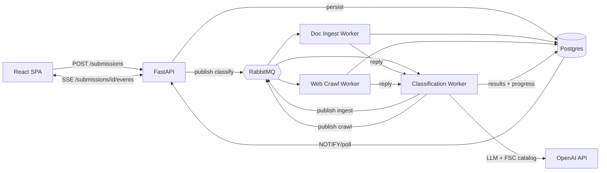

# FSC Code Classifier MVP

## Goal

Per `SP_Task.pdf`: submit company info, output relevant 4-digit FSC codes. Stay MVP-scoped, demo-ready in a few hours, but use the architecture the user picked.

## Architecture



- Workers use RabbitMQ RPC pattern (correlation_id + reply_to) so the Classification Worker awaits sub-worker results.
- FastAPI streams progress events to the SPA via SSE by tailing `submission_events` rows in Postgres (LISTEN/NOTIFY).
- Matcher: LLM-based. NAICS codes (if found in extracted features) are passed as a strong signal alongside capabilities and scraped text. The FSC catalog (parsed once from `AV_FSCClassAssignment._151007.pdf` into JSON) is included in the prompt.

## Monorepo layout

```
salespatriot/
  docker-compose.yml
  .env.example
  apps/
    api/                    # FastAPI service
      app/main.py
      app/routes/submissions.py
      app/routes/events.py  # SSE
      app/db.py
      app/mq.py
      Dockerfile
    web/                    # React SPA (Vite)
      src/App.tsx
      src/api.ts
      Dockerfile
    workers/
      classifier/
        worker.py
        prompts.py
        Dockerfile
      doc_ingest/
        worker.py           # pdfplumber/PyMuPDF text extraction + summary
        Dockerfile
      crawler/
        worker.py           # requests + BeautifulSoup, depth=1, allowlist paths
        Dockerfile
  packages/
    shared/                 # Pydantic schemas, MQ helpers, DB models, FSC loader
  data/
    fsc_catalog.json        # generated from the FSC PDF
  scripts/
    parse_fsc_pdf.py        # one-shot, run before first build
```

## Data model (Postgres)

- `submissions(id, company_name, website_url, email_domain, status, created_at)`
- `documents(id, submission_id, filename, raw_text, summary)`
- `crawls(id, submission_id, urls_visited jsonb, raw_text, summary)`
- `classifications(id, submission_id, fsc_codes jsonb, model, prompt_hash, created_at)` where `fsc_codes` is `[{code, title, rationale, confidence}]`
- `submission_events(id, submission_id, kind, payload jsonb, created_at)` — drives SSE via `LISTEN submission_events`

## Flow

1. SPA POSTs form (multipart for optional PDF) to `/submissions`.
2. API writes `submissions` row, stores file, publishes `classify.requested` to RabbitMQ, returns `submission_id`.
3. SPA opens `GET /submissions/{id}/events` (SSE).
4. Classification Worker receives `classify.requested`, publishes `doc_ingest.requested` (if a doc exists) and `crawl.requested` with `correlation_id`s and `reply_to` queues. Emits progress events.
5. Doc Ingest Worker extracts text with `pdfplumber`, produces a short LLM summary of capabilities/products/services/NAICS, replies.
6. Crawl Worker fetches homepage, follows in-domain links matching `/about|/products|/services|/capabilit|/parts`, depth 1, max ~8 pages, strips boilerplate, produces a short LLM summary, replies.
7. Classification Worker merges summaries into a `CompanyFeatures` object, calls LLM with the FSC catalog + features, parses JSON `{codes: [{code, title, rationale, confidence}]}`, validates each `code` against the catalog (drops unknown), writes `classifications` and emits `classification.completed`.
8. API forwards events to SPA via SSE. SPA renders codes + rationale.

## Key implementation notes

- LLM provider: OpenAI by default (`OPENAI_API_KEY`), model `gpt-4o-mini` for cost/latency, configurable via env. Keep prompts in `apps/workers/classifier/prompts.py`.
- FSC catalog: parse the 4-digit `NNNN  Description` lines from `AV_FSCClassAssignment._151007.pdf` into `data/fsc_catalog.json` once via `scripts/parse_fsc_pdf.py`. Loaded by the Classification Worker at startup.
- Validation: the Classification Worker must drop any 4-digit code the LLM hallucinates that is not in the catalog. This is the only "normalization" required; no separate normalized DB table needed.
- Crawler: respect `robots.txt`, 10 s per-request timeout, total budget ~30 s, User-Agent identifies the app.
- Missing inputs: if no document, skip Doc Ingest; if URL fetch fails, continue with whatever is available. The LLM call still runs.
- No auth, no multi-tenant, no edit flows. Single-form, single-result page.

## Demo plan

- `docker compose up --build` boots everything locally.
- Submit Test 1 (H&R Parts) and Test 2 (Loos & Co) with just URL.
- Submit Test 3 (LSDP) with the capability statement PDF; NAICS 332710/332721/332722/332510 will be extracted and fed to the LLM.
- Live demo with the unseen 4th company.

## Out of scope (explicitly)

- Auth, user accounts, RBAC.
- OCR for scanned PDFs (text-based PDFs only).
- A normalized relational FSC code table — the JSON catalog + LLM-output validation is sufficient.
- Production-grade retry/dead-letter handling; basic ack/nack only.
- Multi-step onboarding UI.

