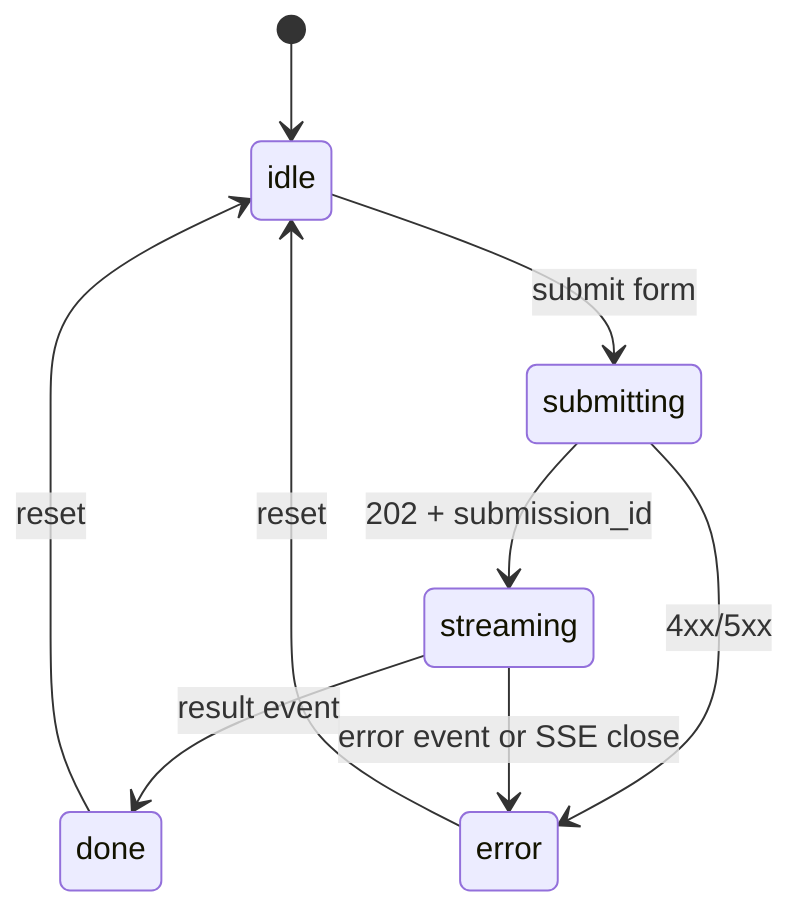

# Agent 1 of 3: React SPA

## Scope and ownership

Owns only `apps/web/`. Does not touch backend code, docker-compose, DB, or shared packages.

## Consumed contracts (read-only, owned by Classification Worker agent)

API base: `http://localhost:8000`

- `POST /submissions` — `multipart/form-data`
  - fields: `company_name` (str, required), `website_url` (str, required), `email_domain` (str, optional), `file` (binary, optional)
  - response 202: `{ "submission_id": "uuid", "status": "queued" }`
- `GET /submissions/{id}` — JSON of current state for resume/refresh
  - response: `{ "submission_id", "status", "fsc_codes": [...] | null }`
- `GET /submissions/{id}/events` — SSE
  - event types: `progress`, `result`, `error`
  - `progress` payload: `{ "stage": "crawl"|"ingest"|"classify", "status": "started"|"done"|"failed", "detail": str | null }`
  - `result` payload: `{ "fsc_codes": [{ "code": "3408", "title": "Machining Centers and Way-Type Machine", "rationale": "...", "confidence": 0.0-1.0 }] }`
  - `error` payload: `{ "message": str }`

`code` is always a 4-digit string `^\d{4}$`. Treat the catalog as opaque text; do not re-validate codes client-side.

## Stack

- Vite + React 18 + TypeScript
- Tailwind CSS for styling
- Native `EventSource` for SSE
- `fetch` for POST/GET, no extra HTTP lib
- No router needed; single page with two views (form, results) toggled by local state
- Vitest + React Testing Library for component tests

## Pages / components

- `App` — owns submission state machine: `idle -> submitting -> streaming -> done | error`
- `SubmissionForm` — controlled inputs, file picker, submit handler, basic client-side validation (URL format, required fields)
- `ProgressPanel` — renders a checklist of stages (`ingest`, `crawl`, `classify`) with status icons fed by `progress` events
- `ResultsList` — renders 4-digit code cards: code (mono, large), title, rationale (collapsible), confidence bar
- `ErrorBanner` — shown on `error` event or fetch failure
- `api.ts` — thin wrapper: `postSubmission(form)`, `subscribeEvents(id, handlers)` that returns a cleanup fn

## State machine

## Local dev

- `npm run dev` for Vite dev server on port 5173.
- Proxy `/api` to `http://localhost:8000` via Vite config so the SPA can call relative paths.
- Until the API is up, mock with a tiny `src/api.mock.ts` selected via `VITE_USE_MOCK=true` that fakes a POST and emits a scripted SSE stream.

## Dockerfile

- Multi-stage: `node:20-alpine` build, serve static via `nginx:alpine` on port 80.
- Nginx config proxies `/api` and `/events` to the `api` service inside the compose network.

## Tasks (atomic)

1. `apps/web/` Vite + TS + Tailwind scaffold, ESLint, Prettier.
2. Implement `api.ts` with `postSubmission` and `subscribeEvents`.
3. Build `SubmissionForm` with field validation.
4. Build `ProgressPanel` driven by `progress` events.
5. Build `ResultsList` rendering code cards.
6. Wire `App` state machine and error handling.
7. Add `api.mock.ts` plus `VITE_USE_MOCK` switch and a scripted event sequence for local demo.
8. Write Vitest tests for `api.ts` parsing of SSE event types and for `ResultsList` rendering.
9. Add Dockerfile + nginx config; add a `apps/web/README.md` describing dev and prod runs.

## Done criteria

- `npm run dev` boots the form; submitting it with `VITE_USE_MOCK=true` walks through progress and shows codes.
- Built container served by nginx renders the form against the live API via docker-compose.

## Out of scope

- Auth, multi-page routing, persistence between visits.
- Editing or re-running submissions.
- Pretty animations beyond a basic spinner.

