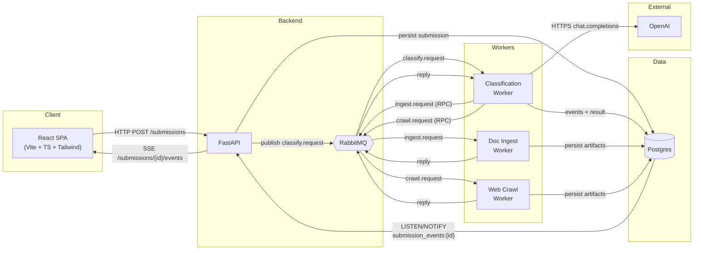

# View

High-level architecture (MVP).

Legend:
- Solid arrows = data/control flow.
- `{{...}}` = message broker, `[(...)]` = database, `[...]` = service.
- AMQP traffic between workers is RPC (`reply_to` + `correlation_id`).
- One classification per submission; FSC catalog is loaded in-process by the Classification Worker.
