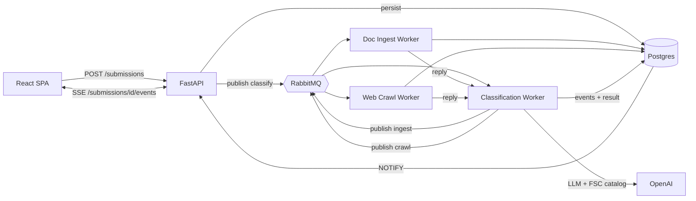

# View

```mermaid
flowchart LR
    SPA["React SPA"] -->|"POST /submissions"| API["FastAPI"]
    SPA <-->|"SSE /submissions/id/events"| API
    API -->|"persist"| PG[("Postgres")]
    API -->|"publish classify"| MQ{{"RabbitMQ"}}
    MQ --> CW["Classification Worker"]
    CW -->|"publish ingest"| MQ
    CW -->|"publish crawl"| MQ
    MQ --> DI["Doc Ingest Worker"]
    MQ --> WC["Web Crawl Worker"]
    DI --> PG
    WC --> PG
    DI -->|"reply"| CW
    WC -->|"reply"| CW
    CW -->|"LLM + FSC catalog"| LLM["OpenAI"]
    CW -->|"events + result"| PG
    PG -->|"NOTIFY"| API
```
